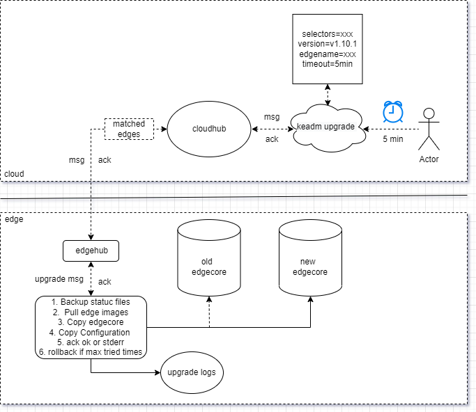

# keadm upgrade

---
title: Proposal for keadm upgrade
authors:
  - "@fisherxu"
  - "@Poorunga"
  - "@zhu733756"
approvers:
  - 
creation-date: 2022-03-19
last-updated: 2022-03-19
status: Implememted
---

## Goals

How to smoothly upgrade online is one of the goals of this proposal.  

There are generally three areas of work involved:
- Cloud waiting timeout and the matched edge nodes to excute upgrade steps.
- Edge side ack to the cloud when the upgrade steps are successful or failed.
- Backup the static files and rollback to run the old edgecore.

The workflow can be described as follows:
